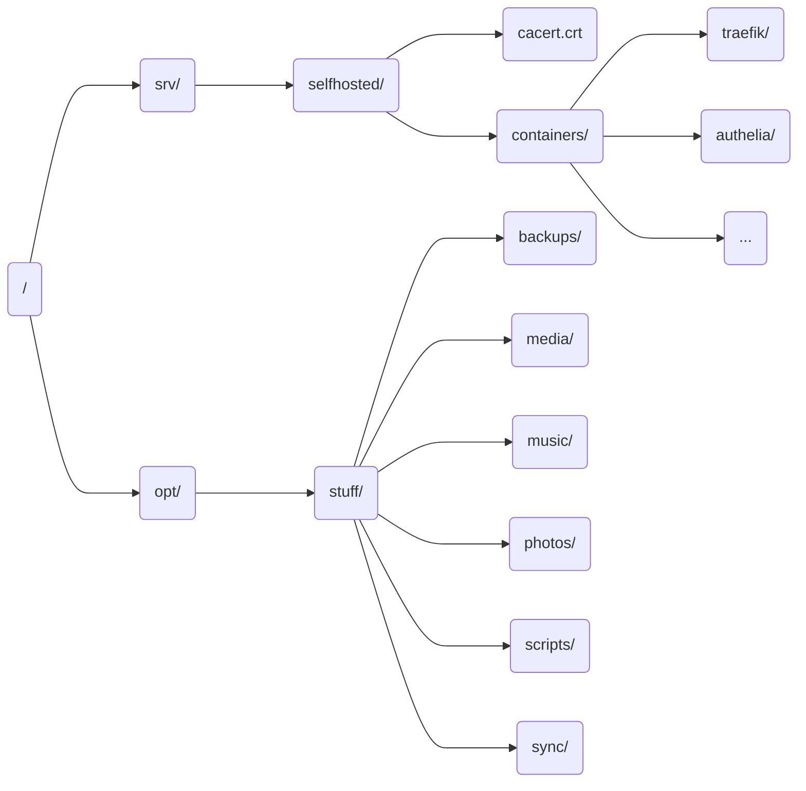

# Orange PI
As explained briefly in the [introduction][introduction], my local system is an [Orange PI 5B](http://www.orangepi.org/html/hardWare/computerAndMicrocontrollers/service-and-support/Orange-Pi-5B.html), boasting 16GB of memory, 4 CPU cores and 4 NPU cores.

## Physical setup
### Small case
I like to be a clean person, so I wasn't just going to put that SoC lying around. I wanted it to be **protected from dust** and also **cooled** by a fan. 


Fortunately for me, the case already had a fan with it! Unfortunately for me, that fan only had pins for 5V and GND, which means it was missing a PWM pin, making it impossible to control the fan. This problem caused a ***small* hissing sound** to be heard by the fan always running at full speed, it wasn't the end of the world but it bothered me enough to go find an alternate solution.

### Noctua fan
Before starting this project I had already heard Noctua had some of the most silent fans out there, so for me it was the obvious choice. I did some digging and found this [5V Noctua fan](https://www.noctua.at/en/products/nf-a4x10-pwm). I then found a diagram for the GPIO pins and plugged them in their corresponding spots.


!!! info
    How the PWM signal is controlled is explained later on [in the organisation section][installing-the-fan-service].

### NVMe storage
The Orange PI 5 comes with a tiny PCIe WiFi card plugged in at the bottom, mostly for IoT, but that wasn't my use case so I got rid of it and plugged in a 256GB SSD (which would be upgraded to a 1TB SSD later down the line) instead.

### Uninterrupted power
I also didn't want my selfhosted server to go down so I got an UPS (Uninterrumpted Power Supply), specifically a 700VA [Eaton 3S](https://www.eaton.com/es/es-es/skuPage.3S700D.html).

## Operating system
When it comes to choosing an operating system, in server use cases I always go for Debian, so I went to the **official manufacturer's page** and downloaded a Debian 11 minimal image.

### The manufacturer's OS experience
I flashed everything onto the SD card and mounted the SSD as a secondary volume, and that setup worked flawlessly for a while, but the SD card would randomly just *die* on me, thus making the system unresponsive. Also digging through `dmesg` I found the Linux kernel was a debug image, which was honestly *a bit* worrying. But the real problem came when trying to update Debian, because the repos did not contain the image for my specific SoC.

So I decided to do what any *completely normal* person would do and I pulled the user manual with the instructions on how to compile the kernel for this SoC. It took me around 2 hours to finally get the `.deb` package I needed to update the kernel, I transferred it over to the system (not without **backing everything up first**) and it all updated like normal.

I rebooted the system but it wasn't working, so I plugged in my trusty monitor and got hit with the systemd emergency shell. It wasn't long until I realised that the problem was the fact that the SSD was **not getting mounted properly**, moreover, it wasn't even getting recognised by the system at all! It took me a while but I eventually ruled that the DTBs (Device Tree Blobs) were the issue, for *some* reason they were not getting loaded properly, so I rolled back to my previous backup and chose to go for a different solution.

### The Armbian experience
My first idea was to just download the Debian 12 image from the manufacturer's page and repeat the process all over again, but since Debian 13 had already released at that point and there was no image for it I realised that in a few years I was going to have the **same problem** again, so after some searching I came across [Armbian](https://armbian.com/), which seemeed like a good option.

This time around I decided to swap the SSD for a 1TB one as mentioned [before][nvme-storage], and just install everything in the SSD, leaving the internal flash for the bootloader only, which finally allowed me to ditch SD cards. With Armbian now running my previous problems were solved, as Armbian has the right kernel images in their repositories.

## Organising everything inside the OS
With the OS flashed and running, it was time to setup some essential software before going with the Docker stacks. I am **not going to explain everything in detail** here as a lot of stuff is *basic* system administration (setting static network IPs, disabling unnecessary systemd services, installing necessary programs, configuring a firewall, etc...).

### Controlling the fan
#### Installing the necessary dependencies
For controlling [the PWM signal][noctua-fan] first it is necessary to install the [wiringOP](https://github.com/orangepi-xunlong/wiringOP) library following the instructions in order to be able to access the GPIO pins. With it we can run the following command to get all of our GPIO pins:
```bash
gpio readall
```
```title="Example output"
+------+-----+----------+--------+---+   OPI5   +---+--------+----------+-----+------+
 | GPIO | wPi |   Name   |  Mode  | V | Physical | V |  Mode  | Name     | wPi | GPIO |
 +------+-----+----------+--------+---+----++----+---+--------+----------+-----+------+
 |      |     |     3.3V |        |   |  1 || 2  |   |        | 5V       |     |      |
 |   47 |   0 |    SDA.5 |     IN | 1 |  3 || 4  |   |        | 5V       |     |      |
 |   46 |   1 |    SCL.5 |     IN | 1 |  5 || 6  |   |        | GND      |     |      |
 |   54 |   2 |    PWM15 |  ALT11 | 1 |  7 || 8  | 0 | IN     | RXD.0    | 3   | 131  |
 |      |     |      GND |        |   |  9 || 10 | 0 | IN     | TXD.0    | 4   | 132  |
 |  138 |   5 |  CAN1_RX |     IN | 1 | 11 || 12 | 1 | IN     | CAN2_TX  | 6   | 29   |
 |  139 |   7 |  CAN1_TX |     IN | 1 | 13 || 14 |   |        | GND      |     |      |
 |   28 |   8 |  CAN2_RX |     IN | 1 | 15 || 16 | 1 | IN     | SDA.1    | 9   | 59   |
 |      |     |     3.3V |        |   | 17 || 18 | 1 | IN     | SCL.1    | 10  | 58   |
 |   49 |  11 | SPI4_TXD |     IN | 1 | 19 || 20 |   |        | GND      |     |      |
 |   48 |  12 | SPI4_RXD |     IN | 1 | 21 || 22 | 1 | IN     | GPIO2_D4 | 13  | 92   |
 |   50 |  14 | SPI4_CLK |     IN | 1 | 23 || 24 | 1 | IN     | SPI4_CS1 | 15  | 52   |
 |      |     |      GND |        |   | 25 || 26 | 1 | IN     | PWM1     | 16  | 35   |
 +------+-----+----------+--------+---+----++----+---+--------+----------+-----+------+
 | GPIO | wPi |   Name   |  Mode  | V | Physical | V |  Mode  | Name     | wPi | GPIO |
 +------+-----+----------+--------+---+   OPI5   +---+--------+----------+-----+------+
```

#### Installing the fan service
Now it is time to go and install [opifancontrol](https://github.com/jamsinclair/opifancontrol) following the instructions and editing the configuration as we see fit (although default values are *usually* enough). Now we can check if the fan speed is changing with the following command:
```bash
journalctl -u opifancontrol
```
```title="Example output"
opifancontrol.sh: Changing Fan Speed | CPU temp: 60, target PWM: 96, current PWM: 72
```

### Removing ram logging
By default, Armbian stores all logs in a `zram` partition, and since everything is running in a single SSD, we can disable that. First of all we need to change the ramlog settings and disable the corresponding truncate cron jobs:
```title="/etc/default/armbian-ramlog"
{--ENABLED=true--}
{++ENABLED=false++}
```
```title="/etc/cron.d/armbian-truncate-logs"
{++#++}*/15 * * * * root /usr/lib/armbian/armbian-truncate-logs
{++#++}@reboot root /usr/lib/armbian/armbian-truncate-logs
```
```title="/etc/cron.daily/armbian-ramlog"
{++#++}systemctl is-active --quiet logrotate.timer && exit 0
{++#++}/usr/lib/armbian/armbian-ramlog write >/dev/null 2>&1
```

!!! info "Actually..."
    This specific one is not really a problem since we are going to disable the timer so the cron job would just exit but it's a caution measure regardless.

```title="/etc/systemd/journald.conf"
{++#++}SystemMaxUse=50M
```

And now we can proceed to disable all relevant services:
```bash
systemctl disable logrotate.timer
systemctl disable armbian-ramlog.service
systemctl disable rsyslog
```

Now it's all a matter of restarting the system and we should no longer have our `/var/log` directory mounted on a `zram` partition.

### Enabling hardware acceleration
One cool feature of this RK3588 chip is that is has a bunch of hardware acceleration features that we can use to our advantage, but installing it was *a bit confusing* and there was not much information about it. The things we need are:

- The vendor kernel
- The mali firmware
- The corresponding `libmali` version for our chip

#### Vendor kernel and firmware
To check if we are using the vendor kernel we only need to check in the `apt` list:
```bash
apt list --installed | grep vendor
```
```title="Example output"
armbian-bsp-cli-orangepi5-vendor/trixie,now 26.5.1 arm64 [installed]
linux-dtb-vendor-rk35xx/trixie,now 26.5.1 arm64 [installed]
linux-headers-vendor-rk35xx/trixie,now 26.5.1 arm64 [installed]
linux-image-vendor-rk35xx/trixie,now 26.5.1 arm64 [installed]
linux-u-boot-orangepi5-vendor/trixie,now 26.5.1 arm64 [installed]
```

If you don't have the vendor kernel then you should look [in the Armbian docs](https://docs.armbian.com/User-Guide_Armbian-Config/System/), for information on how to install other kernels.

If you have already installed the Armbian vendor image directly you should already have the firmware too over at `/lib/firmware/mali_csffw.bin`, otherwise you can obtain it in [the orangepi Github](https://github.com/orangepi-xunlong/firmware/tree/master/arm/mali/arch10.8).

#### Installing libmali
This can get a bit confusing due to the [enormouse amount of libmali versions](https://github.com/tsukumijima/libmali-rockchip/releases/tag/v1.9-1-20260312-bd33ee2) that exist, and unless you understand anything about those filenames, your best bet is **looking at forums online** to see which one people install for a specific board. In my case it was `libmali-valhall-g610-g13p0-gbm_1.9-1_arm64.deb`. Now it's just a matter of installing it with `dpkg`, which should install the necessary shared object over at `/usr/lib/aarch64-linux-gnu/libmali.so`.

### Setting up NUT
Now it was time to configure [the UPS I previously mentioned][uninterrupted-power]. For that I decided to go for NUT (Network UPS Tools), which is the standard on Linux really. I setup everything following [Techno Tim's guide](https://technotim.com/posts/NUT-server-guide/), so I will only cover here the things I had to do differently.

#### Setting up udev rules
Turns out that to prevent NUT from crashing when connecting the UPS through USB, we need to change some udev rules to allow the specific device to be manipulated by the `nut` group. First it is necessary to identify the USB product and vendor IDs:
```bash
lsusb
```
```title="Example output"
Bus XXX Device YYY: ID xxxx:yyyy UPS Systems
```

We are interested in the `xxxx:yyyy` part of the output of our device, which we will put into a new `udev` rule that restarts the `upsd` driver after changing the permissions on the USB device:
```title="/etc/udev/rules.d/99-nut-ups.rules"
SUBSYSTEM!="usb", GOTO="nut-usbups_rules_end"

ACTION=="add|change", SUBSYSTEM=="usb|usb_device", SUBSYSTEMS=="usb|usb_device", ATTR{idVendor}=="xxxx", ATTR{idProduct}=="yyyy", MODE="664", GROUP="nut", RUN+="/sbin/upsdrvctl stop; /sbin/upsdrvctl start"

LABEL="nut-usbups_rules_end"
```

Now we just reload the rules and then replug the UPS and restart all relevant services to, *hopefully*, see everything working properly:
```bash
udevadm control --reload
```

#### My NUT script
I handle NUT to automatically power off the system if the UPS has been on battery for a while and also send notifications through a webhook whenever the battery is activated:
```title="/etc/nut/upssched-cmd"
#!/bin/sh
hookurl="<url>"
case $1 in
       onbatt)
            # Enable beeper
	        upscmd -u monuser -p <password> eaton3s@localhost beeper.enable

            # Log info
            logger -t upssched-cmd "UPS running on battery"
	        curl -i -H "Accept: application/json" -H "Content-Type:application/json" -X POST --data "{\"content\": \"**UPS**: Running on battery\"}" $hookurl
          ;;
       onpower)
            # Log info
	        logger -t upssched-cmd "UPS power restored"
	        curl -i -H "Accept: application/json" -H "Content-Type:application/json" -X POST --data "{\"content\": \"**UPS**: Power restored\"}" $hookurl
	        ;;
       mute_beeper)
            # Disable beeper
	        upscmd -u monuser -p <password> eaton3s@localhost beeper.mute

            # Log info
	        logger -t upssched-cmd "Turning off beeper"
	        ;;
       onbatt_shutdown)
            # Log info
            logger -t upssched-cmd "Server shutting down (time on battery exceeded)"
	        curl -i -H "Accept: application/json" -H "Content-Type:application/json" -X POST --data "{\"content\": \"**OPI**: Server shutting down (time on battery exceeded)\"}" $hookurl
            # Wait 5 seconds 
	        sleep 5

            # Shuts down the system
	        /sbin/shutdown -h +0

            # Shuts down the UPS
            # CAN BE DANGEROUS !!
            # /sbin/upsmon -c fsd
            ;;
       commbad)
            # Log info
            logger -t upssched-cmd "UPS has been gone too long, can't reach"
	        curl -i -H "Accept: application/json" -H "Content-Type:application/json" -X POST --data "{\"content\": \"**OPI**: UPS has been gone too long, can't reach\"}" $hookurl
            ;;
       commok)
            # Log info
	        logger -t upssched-cmd "UPS reconnected"
	        curl -i -H "Accept: application/json" -H "Content-Type:application/json" -X POST --data "{\"content\": \"**OPI**: UPS reconnected\"}" $hookurl
	        ;;
       *)
            # Unexpected command
            logger -t upssched-cmd "Unrecognized command: $1"
            ;;
esac
```

### Setting up local DNS
To setup local DNS on my server, I needed **both** a DNS server and a TLS certificate with my own CA. For the latter I mostly followed [this guide](https://medium.com/@seabro/how-to-create-selfsigned-ca-and-custom-wildcard-ssl-certificate-1112ed2080f7).

#### Choosing a DNS server
Any DNS server works for local use, but I personally recommend either [Adguard](https://adguard-dns.io/en/welcome.html) or [Pihole](https://pi-hole.net/). I have both running, with the former as primary DNS.

#### Creating a CA
First it is necessary to create a private key for the CA and a public certificate with said key:
```bash
openssl genrsa -des3 -out CA.key 4096
openssl req -new -x509 -days 3650 -key CA.key -out CA.crt
```

!!! warning "Important!"
    It is **not possible** to make a certificate that cannot expire, which is why this is set to expire in 10 years.

#### Creating a certificate
First we create a private key for the domain:
```bash
openssl genrsa -out domain.key 2048
```

Now we choose **any local domain of our liking** and we create a configuration for it:
```title="openssl.cnf"
[req]
default_md = sha256
prompt = no
req_extensions = req_ext
distinguished_name = req_distinguished_name

[req_distinguished_name]
commonName = *.example.com
countryName = ES
stateOrProvinceName = <Something>
organizationName = <Something>

[req_ext]
keyUsage=critical,digitalSignature,keyEncipherment
extendedKeyUsage=critical,serverAuth,clientAuth
subjectAltName = @alt_names

[alt_names]
DNS.1=example.com
DNS.2=*.example.com
```

Finally, we create the request for certificate and we sign it with our CA:
```bash
openssl req -new -nodes -key domain.key -config openssl.cnf -out domain.csr
openssl x509 -req -in domain.csr -CA CA.crt -CAkey CA.key -CAcreateserial -out domain.crt -days 1024 -sha256 -extfile openssl.cnf -extensions req_ext
```

!!! warning "Important!"
    Same as before, we cannot create a certificate that does not expire, so this one is set to expire in around 3 years.


### Setting up necessary directories
Since this server is only really managed by myself, I could just leave everything under the `/home` directory, but I decided that isn't the cleanest option and so after a bit of thinking I ended up with **2 main directories** from where everything branches, `/srv/selfhosted` (which stores all data related to containers) and `/opt/stuff` (which stores important data that different services use).



#### The selfhosted directory
As stated previously, this directory stores information relevant to all services in the system. My setup contains **exclusively** Docker containers, so the `containers/` folder stores each Compose stack separately in its own folder. This directory also contains the certificate for [my own CA][creating-a-ca], mainly used by services with [OIDC](https://openid.net/developers/how-connect-works/) to prevent TLS issues.

#### The stuff directory
I didn't really know what name to give to this one so I just named it the *stuff* directory, composed of:

- `backups/`: Stores backups for all services on the system
- `media/`: Stores video files for movies and series.
- `music/`: Stores music files for my music library.
- `photos/`: Stores photos and videos of my own.
- `scripts/`: Stores useful scripts I use with the system.
- `sync/`: Stores files that are synchronised with other systems.
