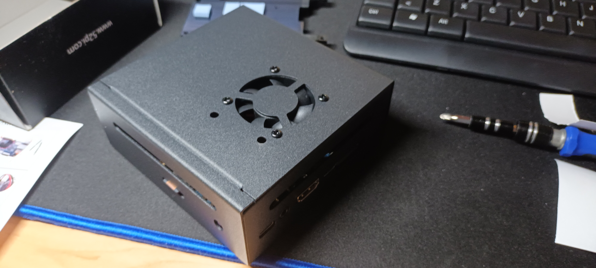
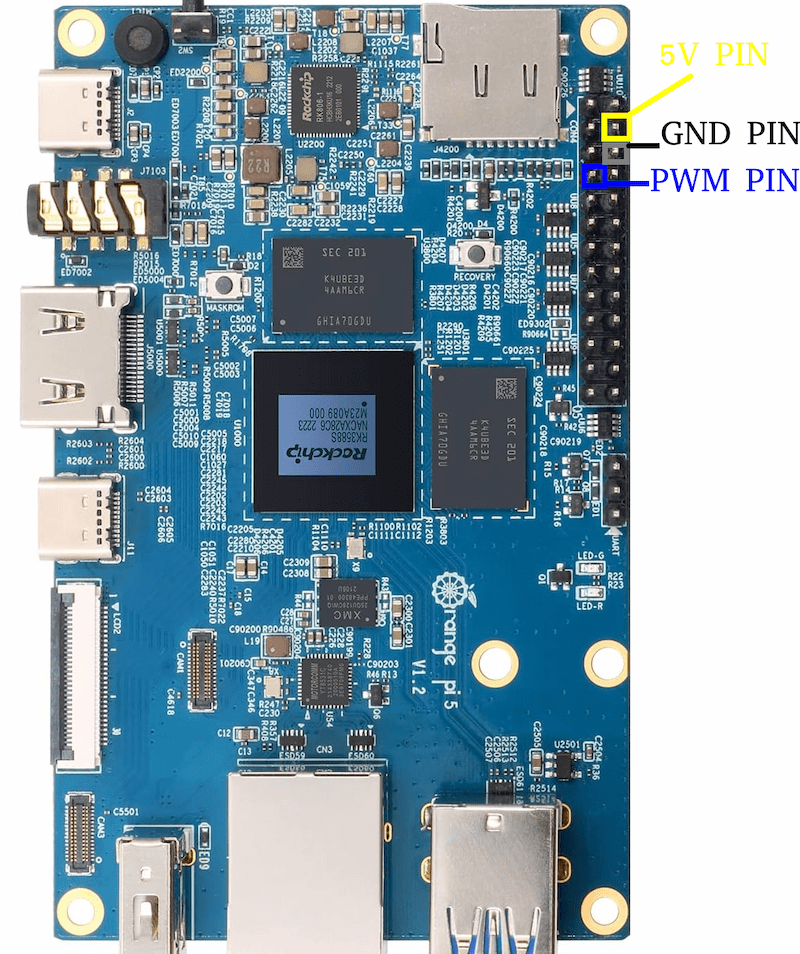

# Orange PI
As explained briefly in the [introduction][introduction], my local system is an [Orange PI 5B](http://www.orangepi.org/html/hardWare/computerAndMicrocontrollers/service-and-support/Orange-Pi-5B.html), boasting 16GB of memory, 4 CPU cores and 4 NPU cores.

## Physical setup
I like to be a clean person, so I wasn't just going to put that SoC lying around. I wanted it to be protected from dust and also cooled by a fan. 

Fortunately for me, the case already had a fan with it! Unforunately for me, that fan only had pins for 5V and GND, if you haven't yet guessed what problems that entails, it is the fact that it's missing a PWN pin, meaning the fan speed cannot be controlled. This problem caused a small hissing sound to be heard by the fan always running at full speed, it wasn't the end of the world but it bothered me enough to go find an alternate solution.

### Noctua fan
Before starting this project I had already heard Noctua had some of the most silent fans out there, so for me it was the obvious choice. I did some digging and found this [5V Noctua fan](https://www.noctua.at/en/products/nf-a4x10-pwm). I then found a diagram for the GPIO pins and plugged them in their corresponding spots.

!!! info
    How the PWM signal is controlled is explained later on.

### Storage
The Orange PI 5 comes with a tiny PCIe WiFi card plugged in at the bottom, mostly for IoT use cases, but IoT wasn't my use case so I got rid of it and plugged in a 256GB SSD (which would be upgraded to a 1TB SSD down the line).

### Power
I also didn't want my selfhosted server to go down so I got an UPS (Uninterrumpted Power Supply), specifically a 700VA [Eaton 3S](https://www.eaton.com/es/es-es/skuPage.3S700D.html).

## Operating system
When it comes to choosing an operating system, in server use cases I always go for Debian, so I went to the official manufacturer's page and downloaded a Debian 11 minimal image (which would definetly not cause me problems later down the line).

### The manufacturer's OS experience
I flashed everything onto the SD card and mounted the SSD as a secondary volume, and that setup worked flawlessly for a while, but the SD card would randomly just die on me, which I should have seen coming before. Also digging through `dmesg` I found the Linux kernel was a debug image, which was honestly a bit worrying. But the real problem came when trying to update Debian, because the repos did not contain the image for my specific SoC.

So I decided to do what any completely sane person would do and I pulled the user manual with the instructions on how to compile the kernel for this SoC. It took me around 2 hours to finally end up with the `.deb` package I needed to update the kernel, I transferred it over to the system (not without backing everything up first) and everything updated like normal.

But at this point you have probably guessed that it wasn't going to be that easy right? I rebooted the system but it wasn't working, so I plugged in my trusty monitor and got hit with the systemd emergency shell. It wasn't long until I realised that the problem was the fact that the SSD was not getting mounted properly, moreover, it wasn't even getting recognised by the system at all! It took me a while but I eventually ruled that the DTBs (Device Tree Blobs) were the issue, for some reason they were not getting loaded properly, so I rolled back to my backup and chose to go for a different solution.

