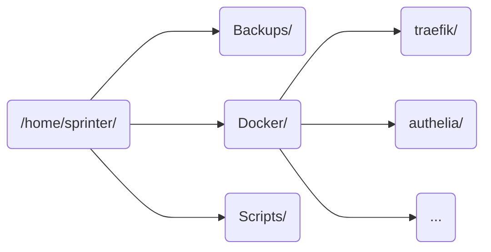

# VPS
As explained briefly in the [introduction][introduction], my remote system is a QEMU virtual machine with 12GB of memory and 6 virtual CPU cores.

!!! info
    The **main reason** why I chose so much memory is because I run a resource heavy mail server and also some other game servers.

## Operating system
When it comes to choosing an operating system, in server use cases I always go for Debian, so I just chose that when setting up the VPS on the provider's webpage. There isn't *really* much to explain about setting up everything as it was just basic system administration and most of it was already set up too (like networking for example) so I could just get to setting up the services.

### Directory structure
For this VPS I just left everything inside the `/home` directory and never really bothered reorganising everything, but it mostly goes the same as in the [orange PI][setting-up-the-necessary-directories].

All **3 main directories** are pretty self-explanatory so I will skip the details this time.
